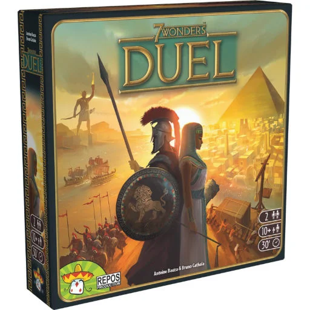
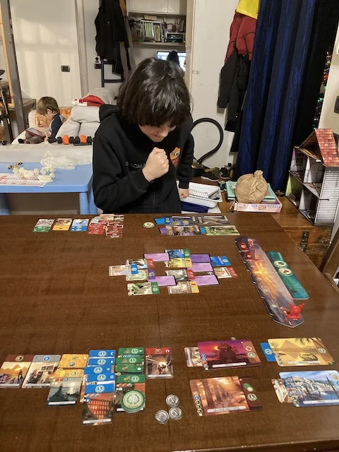
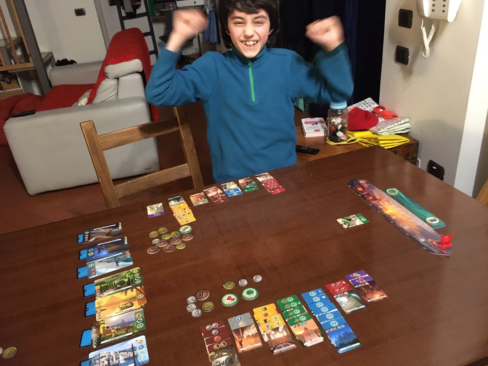

I due giocatori devono costruire i propri regni, comprese le Meraviglie, scegliendo strategicamente le risorse e gli edifici, per ottenere una vittoria o per progresso civile, o scientifico, o militare. con l'espansione Pantheon si aggiungono gli Dei che danno ulteriori poteri.
Difficoltà media e si presta a moltissime partite.

costruisci la tua civiltà antica, comprese di "meraviglie", e sorpassa l'avversario o con supremazia scientifica, o militare o di progresso sociale. 
partita da 30 minuti circa.. non banalissimo come regole (c'è un bel po' di commercio e tattiche) ma neanche troppo difficile. di fatto è uno dei giochi da due più premiati.
per la cronaca stavo vincendo con un livello di progresso enorme.. ma all'ULTIMA CARTA mi sbaraglia con un'avanzata militare da 3 scudi arg arg

> [!tip] Fabio
> Mi piace perché è ambientato nella storia e perché puoi decidere se vuoi vincere per civilizzazione, guerra o scienza

> [!info] Stefano
> Un gioiello.

