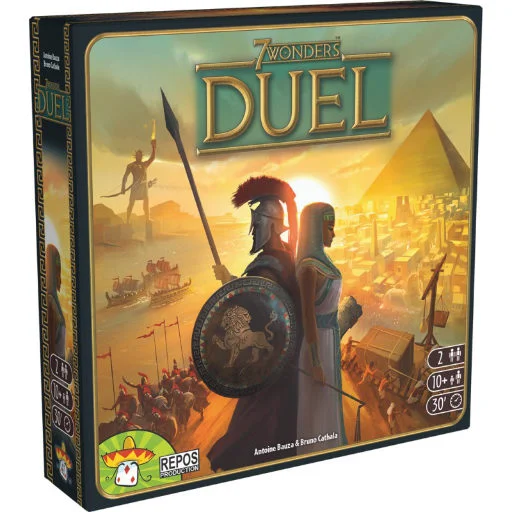
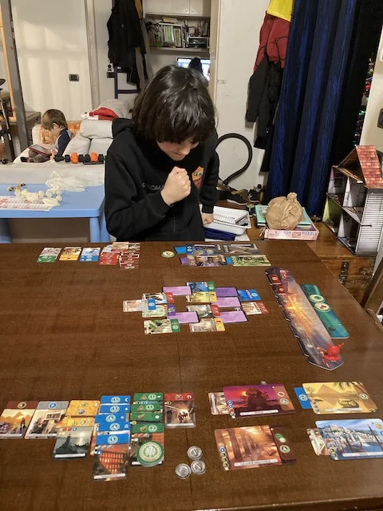
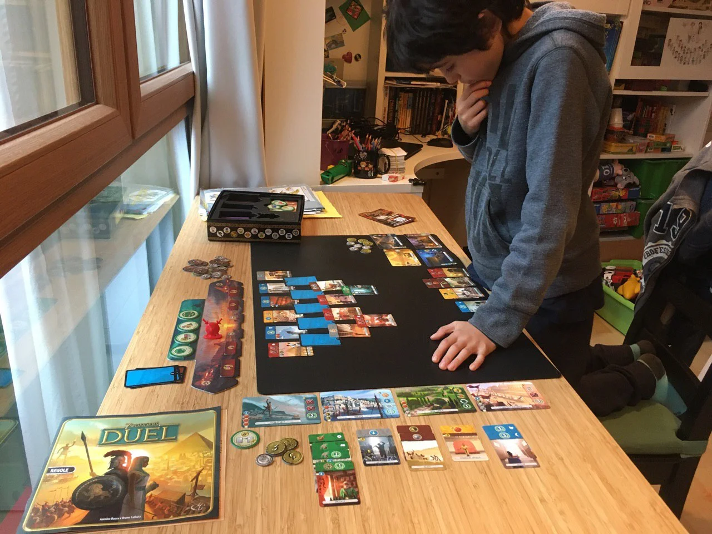

I due giocatori devono costruire i propri regni, comprese le Meraviglie, scegliendo strategicamente le risorse e gli edifici, per ottenere una vittoria o per progresso civile, o scientifico, o militare. con l'espansione Pantheon si aggiungono gli Dei che danno ulteriori poteri.
Difficoltà media e si presta a moltissime partite.

> *Fabio:*
> Mi piace perché è ambientato nella storia e perché puoi decidere se vuoi vincere per civilizzazione, guerra o scienza
{.boxFabio}

> *Stefano:*
> Un gioiello.
{.boxStefano}

