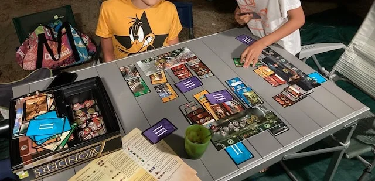

Un gioco che è ormai un classico: evolvi la tua civiltà con progresso sociale, o militare o scientifico, il primo che arriva a svilupparsi pienamente vince.
Abbastanza semplice e BELLO.

> [!tip] Fabio
> grafica bellissima e lo consiglio se siete in tre o più, altrimenti giocate a Duel

> [!info] Stefano
> È uscita ora tutta la nuova edizione! Per chi non si accontenta del gioco usa e getta.

