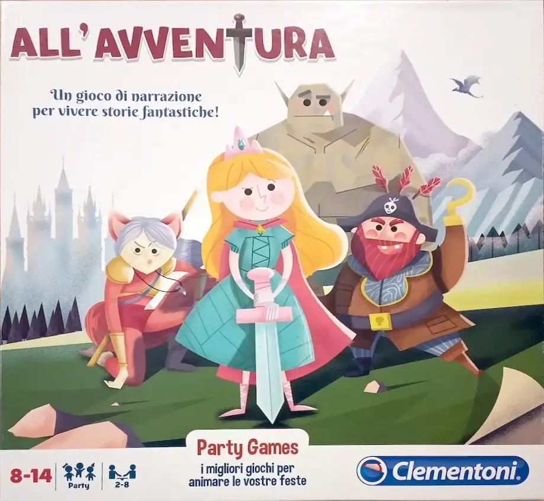

Una bella eperienza far giocare i bambini alla loro prima avventura Gioco di Ruolo!
Un genitore deve fare da master, ovvero leggere i paragrafi e fare da intermediatore tra le loro decisioni e la storia, e ci si diverte tutti.
Nella scatola (che costa davvero pochissimo) ci sono quattro avventure.

> [!info] Stefano
> Il primo Gioco di Ruolo per i vostri ragazzi! Ottimo anche per una festa di compleanno
