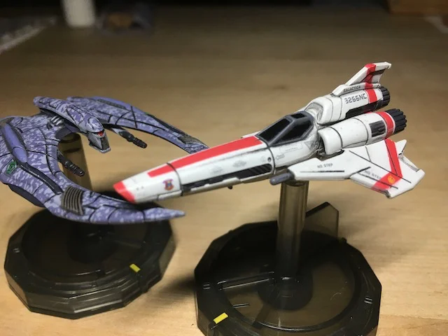
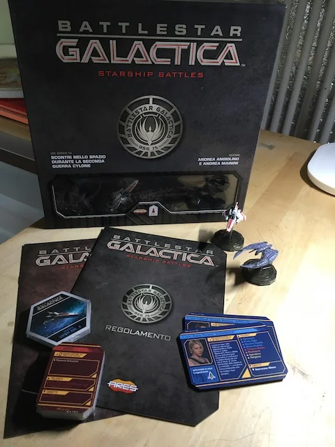

Battaglie spaziali tra Coloni e Siloni, Vipers contro Raiders, nel fantascientifico mondo di BSG (Battlestar Galactica).
Sul modello pluripremiato gioco Wings of Glory (cercarlo se vi piacciono gli scenari di guerre aeree classiche), si inizia a giocare subito con regole semplici che piano a piano diventano più complesse.  

> [!tip] Fabio
> le astronavine sono bellissime ed è bello precalcolare una rotta per andare a sparare

> [!info] Stefano
> Lo ammetto: lo presi perché adoro BSG.. e se non avete visto la serie (quella del 2003) *fatelo!* poi volevamo un gioco di combattimenti tattici, e Andrea Angiolino, l'autore, ha fatto davvero un bel lavoro.

