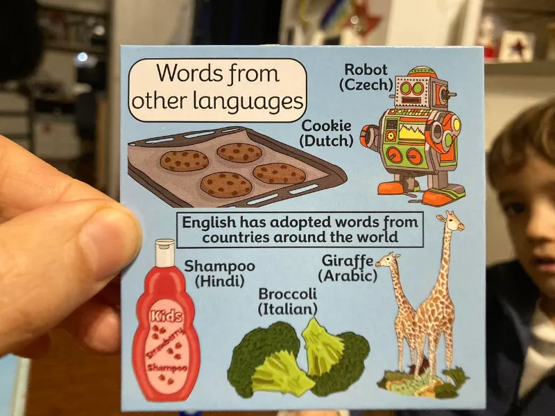

Questo BrainBox ce lo avevamo da due anni ma mai giocato col piccolo.  
Oggi che capisce qualche parola di inglese abbiamo fatto tre schede: deve osservare la carta per 10 secondi (in questo caso di più perché leggiamo insieme tutti i testi) e poi la giri e ci sono 10 domande su quello che hai visto. domande tipo “da che lingua deriva Robot? quanti biscotti ci sono?”

si è divertito molto. per 10 minuti e abbiamo parlato un po’ in inglese. 
e che _shampoo_ fosse una parola indiana non me lo ricordavo!

Ci sono tante scatole di questa serie di BrainBox, noi abbiamo quella "english grammar" per ripassare la grammatica inglese. La scelsi proprio cercando qualcosa per giocare con le parole, i verbi e la grammatica inglese. 

!!! quote_fabio "Fabio"

    per ripassare l'inglese e la memoria.. ogni tanto facciamo una scheda

!!! quote_stefano "Stefano"

    bello perché ci sono cento schede.. ne fai pescare una e lo giochi in 3 minuti. Ma senza un valido supporto e coinvolgimento divertente, sarebbe impossibile che lo giochino da soli. E' un gioco "pretesto", diciamo.
