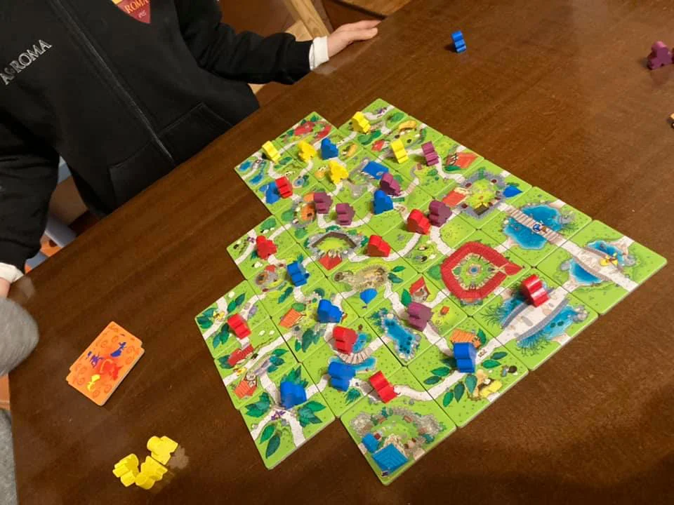
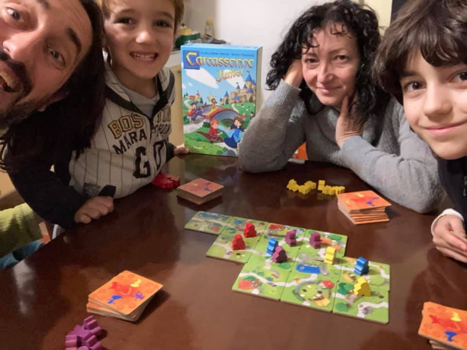

Il gioco in scatola regalato per i 5 anni di Bruno è PERFETTO.
Si impara in 30 secondi, si gioca in 20 minuti ed ha il giusto livello di fortuna tattica per i piccoli e di analisi e arguzia per i più grandi.
Che altro dire... le tessere e i personaggi, tutti bambini, sono ben fatte e "catturano" il giusto. un ottima alternativa alla tv.

> [!tip] Fabio
> è semplice e bello da fare in famiglia. a me e Bruno piace trovare le pecore nere e le mucche dopo la partita.

> [!info] Stefano
> Se poi piace il genere, fra un anno prendete Carcassonne il gioco completo!

