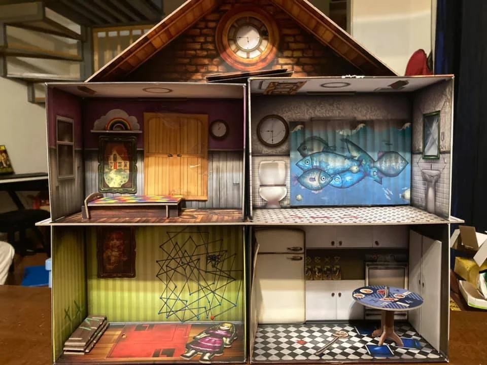
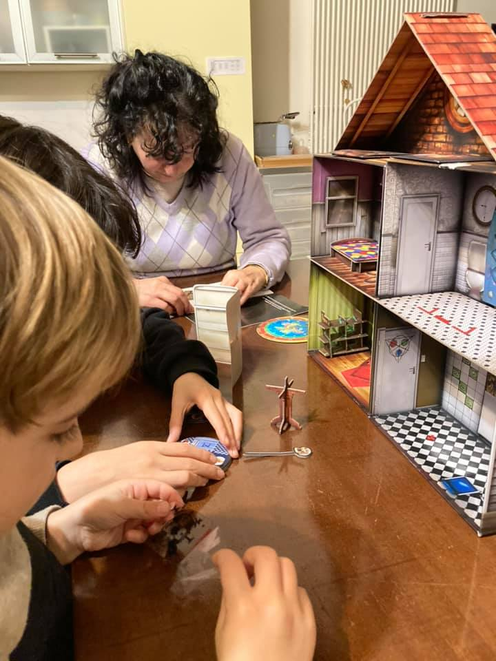

una escape the room ricorsiva!  
credo che a casa nostra abbiamo giocato TUTTE le escape rooms possibili. e non potevano a mancare questa dove la scatola si trasforma nella casa fisica da cui bisogna scappare. 

insomma: chiusi in casa, evadiamo da una micro casa delle bambole 🙂

gli enigmi sono difficili. ma mettendo una colonna sonora paurosa (consigliata da ThinkFun nel loro sito) la serata passa veloce.

> [!tip] Fabio
> è molto immersivo e mi piace perché è difficile

> [!info] Stefano
> Una casa dentro casa vostra che vi terrà svegli per almeno 3 ore con enigmi davvero difficili quanto sorprendenti e vari.  
> Montare la casa aprendo la scatola del gioco e indagare ogni angolino con gli infrarossi,, beh.. è stato un gaudio anche per il piccolo Bruno

