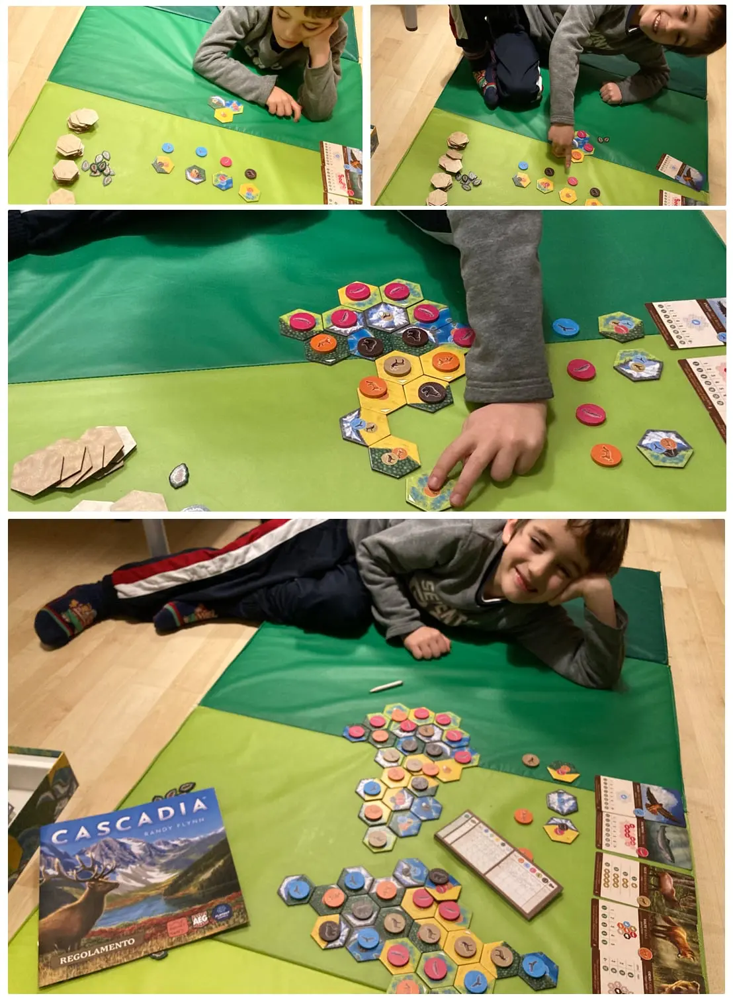

- papà stasera giochiamo a Cascadia?

il potere di lasciare i giochi per casa fa arrabbiare la mamma ma rende felici i papà che vedono i figli impegnati per 40 minuti a fare combinazioni di territori esagonali e di animali selvatici, per fare le combo più renumerative (in termini di punti finali), con tanto di somme finali che la maestra di matematica di seconda ci rimarrebbe di stucco, soprattutto perché a scuola non vuole fare le addizioni ma quando si tratta di giochi calcola a mente conti difficili per me
Cascadia è giustamente il gioco per famiglie dell'anno (scorso).

