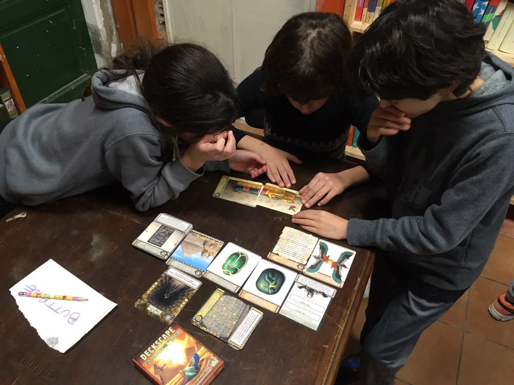

Avventure piene di enigmi non banali da risolvere tutti insieme girando carta dopo carta. Noi li abbiamo giocati tutti e 6 e ci piacciono sempre.

> [!tip] Fabio
> Mi piace molto quando il mazzo di divide in molte storie separate e gli enigmi sono davvero inaspettati

> [!info] Stefano
> Per noi è un gioco importante perché ha "aperto" la fase di esplorazione dei giochi compatti in famiglia

