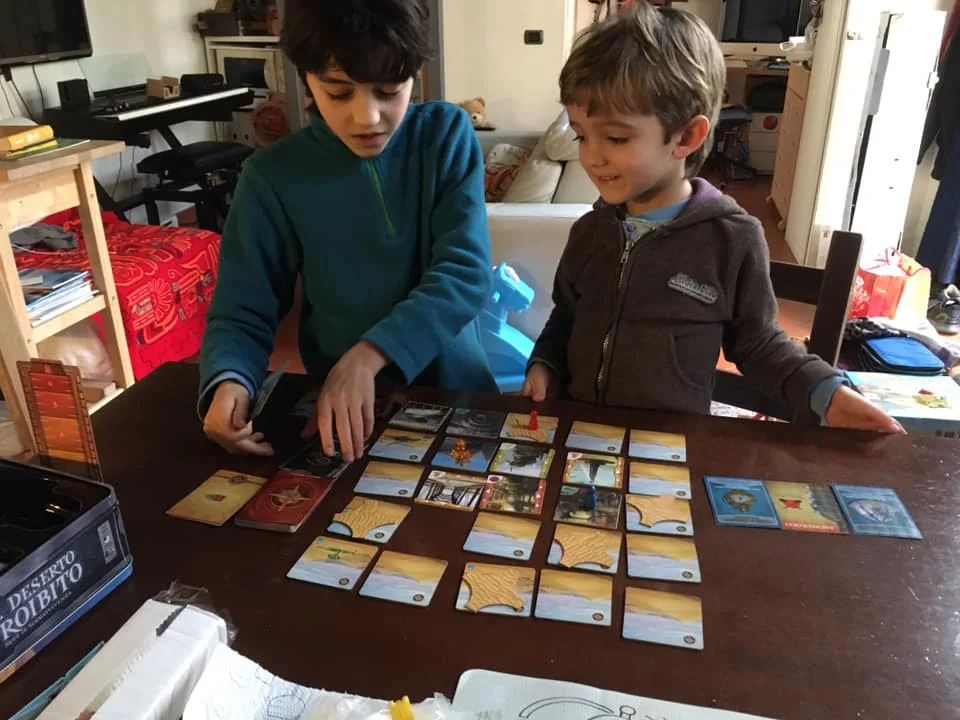

Un capolavoro di cooperativo: bisogna trovare i pezzi dell'astronave cercandoli in un deserto che si muove in continuazione, se un giocatore muore di sete muoiono tutti. bello bello. molto avvincente. lo chiedono spesso.

Se questo gioco piace, segnaliamo l'antecendente *Isola Proibita* [scheda](https://boardgamegeek.com/boardgame/65244/forbidden-island) e il successivo *Cielo Proibito* [scheda](https://boardgamegeek.com/boardgame/245271/forbidden-sky) che abbiamo tutti. CHissà perché.

> *Fabio:*
> fantastico che la mappa cambia ogni volta con la tempesta e lo scavare nella sabbia per trovare oggetti

> *Stefano:*
> si impara a pianificare e cooperare! dal Game Designer di Pandemic.

