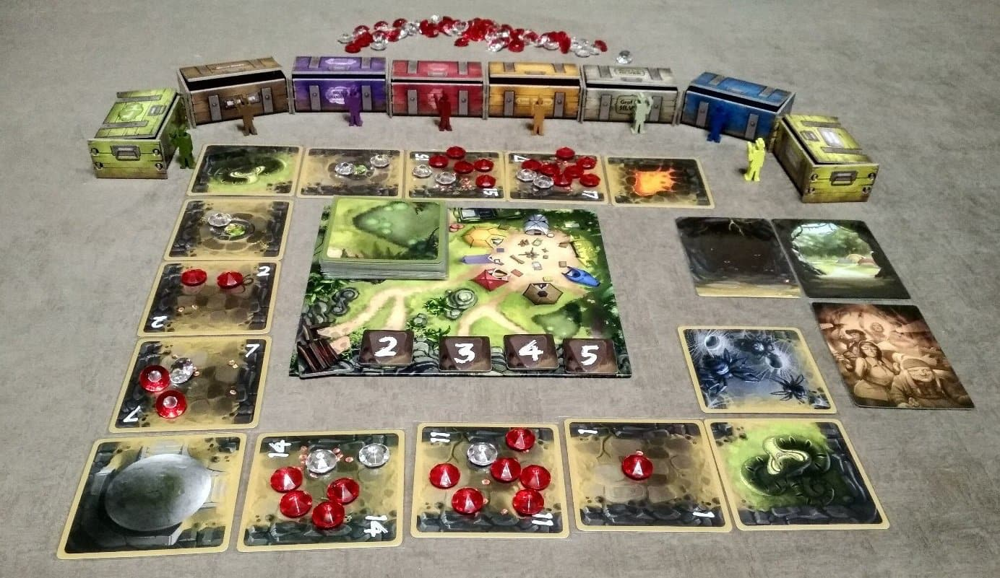

Questo gioco lo abbiamo scoperto durante il COVID su BoardGameArena.. e poi lo abbiamo comprato perché troppo divertente!

E' un "push your luck" alla Indiana Jones.

## Tutorial

<iframe width="560" height="315" src="https://www.youtube-nocookie.com/embed/3G36yBdGu_s?si=8KCZdyf3DzDTbFnf" title="YouTube video player" frameborder="0" allow="accelerometer; autoplay; clipboard-write; encrypted-media; gyroscope; picture-in-picture; web-share" allowfullscreen></iframe>
[📺 YouTube](https://www.youtube.com/watch?v=3G36yBdGu_s)
