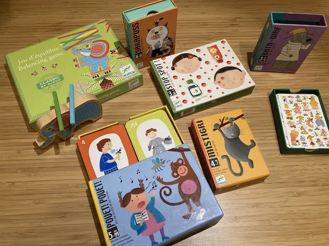

Sono tantissimi i giochi della Djeco. Noi ne abbiamo un po': scatole piccole e semplici con regole perfette per bambini dai 4 anni. Qualunque prendiate è un diertimento valido.

> [!tip] Fabio
> i disegni sono perfetti per i bambini piccoli e ci gioco volentieri con mio fratellino

> [!info] Stefano
> La Djeco è una di quelle marche che garantisce una costante qualità in tutti i suoi prodotti. Bisogna imparare a riconoscerle e poi fidarsi.

