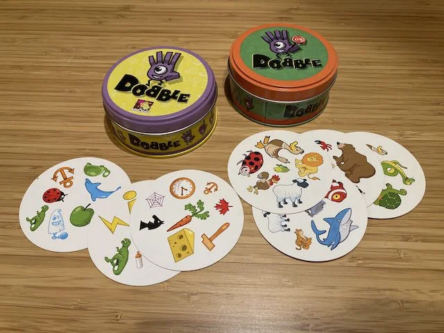

> **#Kids #Visuale #Award #Compatto**  
> 2-8g | 4+ | 15m | facile | [scheda](https://boardgamegeek.com/boardgame/63268/spot-it)  

Un mazzo di 50 carte rotonde dove tra una carte e l'altra c'è *un solo* elemento in comune e che permette diverse modalità di gioco. Perfetto per bambini (per i più piccoli c'è una versione speciale con disegni più semplici).  

> *Fabio:*
> È molto eccitante e allena davvero la vista

> *Stefano:*
> Io ho studiato la matematica che ci sta dietro a questo gioco ed è davvero meravigliosa

{width=49%}

