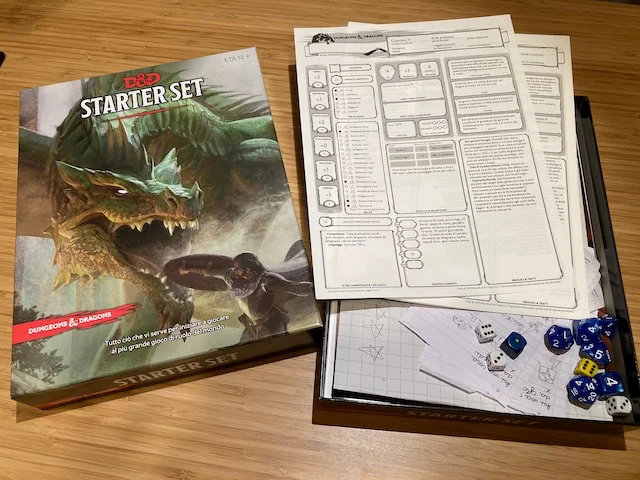

# Dungeons and Dragons
> **#GdR #Narrativo #Award**   
> 2-7g | 10+ | infinito | medio | [scheda](https://boardgamegeek.com/boardgame/94902/dungeons-dragons-starter-set)  

beh.. qui si entra nel mito: il Gioco di Ruolo per antonomasia. il capostipite che da fine anni '70 ha fatto crescere molte generazioni di giocatori, ma sopratutto creatori

> *Fabio:*
> mi piace immergermi in un personaggio ma è molto difficile fare il Master e ci sono tantissime regole quindi non puoi giocarlo al volo con uno che non lo conosce. Spero che altri lo studino per giocarci insieme!

