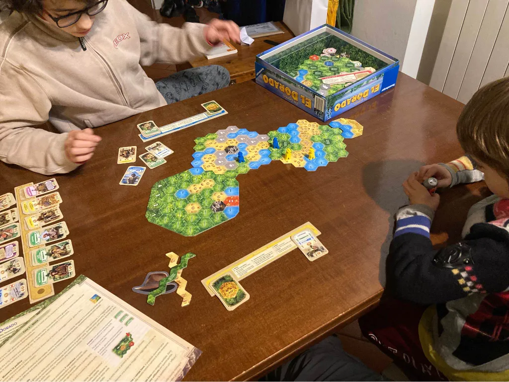

siamo entrati nella foresta amazzonica, attraversando deserti e fiumi, chiamando nella nostra squadra nuovi amici con le diverse capacità per arrivare primi a El Dorado.

ammettiamo che ogni gioco ha le sue regole. e imparare le regole e i meccanismi è già parte del gioco.

non si può vincere senza conoscere bene le regole del gioco, e senza un collaboratore che ti mischia e sceglie le carte.

A volte ci scegliamo le carte a vicenda, perché è ancora più divertente
 (e realistico) giocare con le carte scelte dall'avversario!
questo gioco El Dorado per il momento è più che promosso: si crea il percorso in mille modi, i personaggi sono vari, i meccanismi veloci.

e abbiamo inventato delle regole aggiuntive per dare un vantaggio a giocatori meno esperti, così da giocare tutti.
