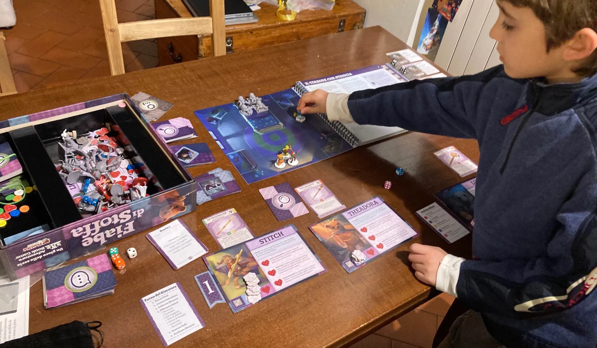
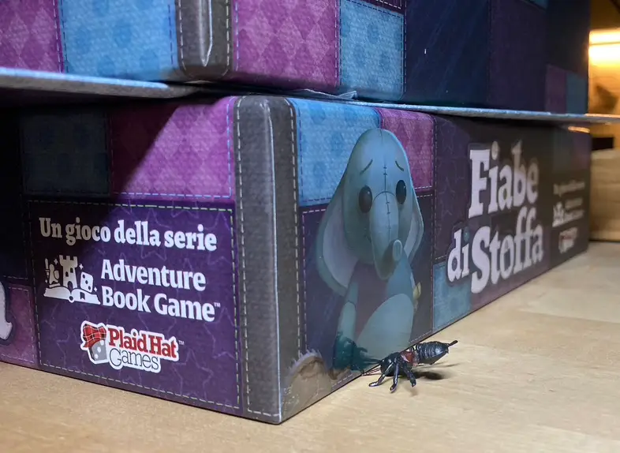
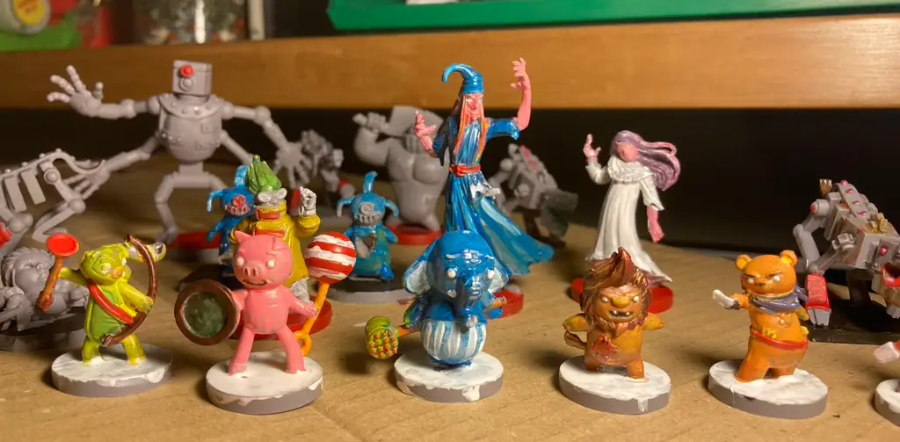
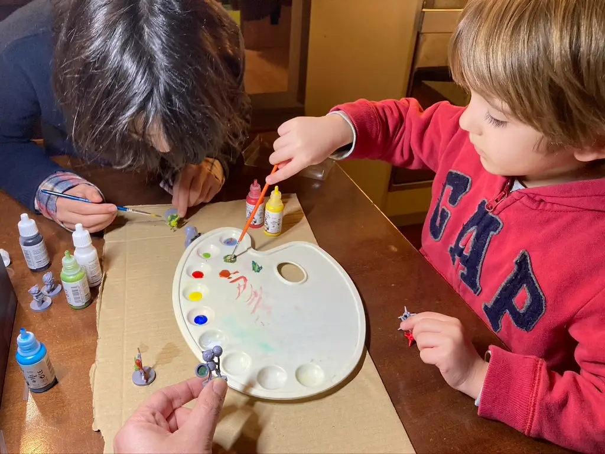

che soddisfazione, quando dopo cena anziché andare alla tv, chiede di giocare a "Fiabe di stoffa", un libro avventura anche abbastanza complicato, dove ogni pagina è una missione, da leggere, fare scelte, combattere, scoprire la storia.

ci sono almeno 50 pagine, quindi se continua l'acchiappo, andremo avanti due mesi!
nb: l'avevamo iniziato ai tempi, poi smesso perché bruno troppo piccolo e poi boh. ma ora è il momento giusto.

il bello è che si gioca benissimo in 2 (controllando due omini a testa) che in 3 o in 4.. quindi la storia va avanti con chi si è.

non dico che lo consiglio a tutti, perché non è semplicissimo... ma se piacciono le belle storie, stare almeno un'ora con i propri figli a giocare, è una bellissima possibilità!

> [!tip] Bruno
> papà andiamo avanti di una pagina a Fiabe di Stoffa?

> [!tip] Fabio
> dipingere le miniature è stato bello

> [!info] Stefano
> un po' complesso da intavolare la prima volta se non si è un po' esperti, ma si ripaga con almeno 60 ore di gioco!

