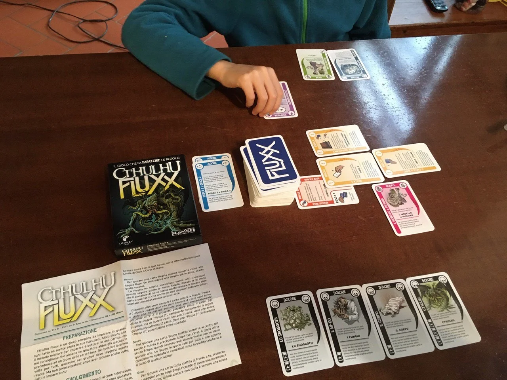

il gioco inizia senza regole, se non con l'unica: _prendi una carta, gioca una carta_.
poi tutto succederà giocando: regole, scopo del gioco, imprevisti, azioni.

davvero semplice quanto geniale!

Ho preso l'edizione Cthulhu solo perché era l'unica rimasta in negozio.. ma ne siamo contenti... a cercarne ci sono almeno 20 temi: dai Monty Python a Star Trek, dalla matematica alla chimica..
Potrebbe anche essere un ottimo gioco "educativo" per esplorare alcune tematiche.
tutto quello che c'è da fare o sapere è infatti scritto nelle carte.

ci è piaciuto assai e lo consigliamo!
costa pochissimo, partite veloci, da 2 a 6 giocatori. cercare FLUXX ecco qui tutti i titoli: <https://www.fluxxgames.com/>

> [!tip] Fabio
> carte molto strane e l'unico in cui le regole del gioco cambiano mentre giochi
