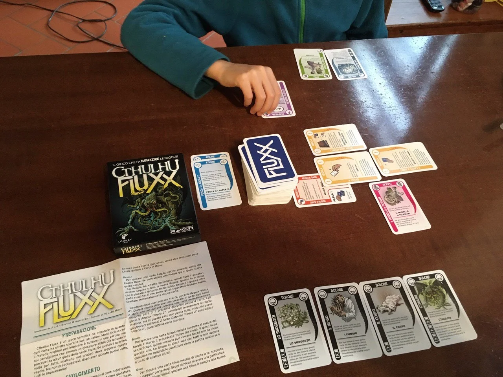

un gioco di carte dove le regole del gioco e l'obiettivo per vincere cambia in continuazione!
geniale. ci sono molte ambientazioni (in inglese una dozzina) alcune addirittura tematiche su chimica o matematica!
in italiano abbiamo questa edizione Chtulu

> *Fabio:*
> carte molto strane e l'unico in cui le regole del gioco cambiano mentre giochi
