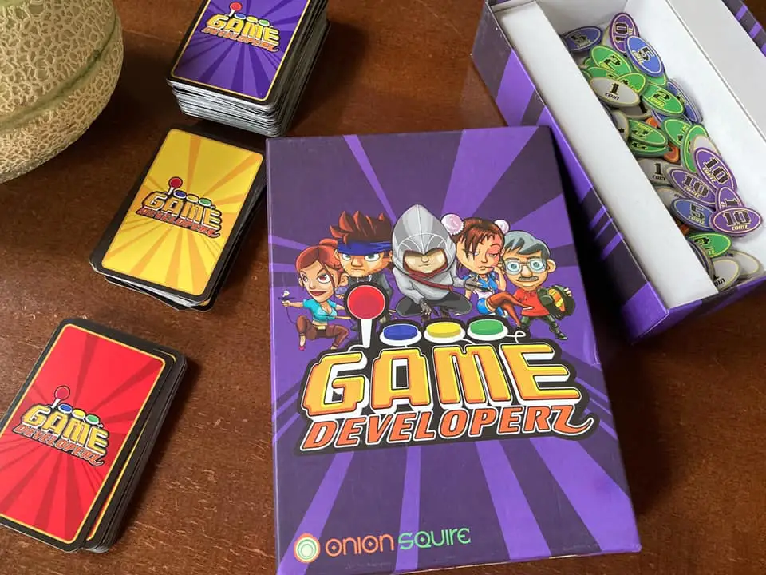

- papà cosa vuol dire Electric Farts?
- ?!?! scoregge elettriche? cosa stai leggendo?
- le istruzioni di questo gioco in scatola
- Game Devz! bello non ci abbiamo mai giocato
- appunto per questo l’ho scelto così ci giochiamo 
- e stai leggendo le istruzioni in inglese?
- si
- ma allora oggi è il giorno più bello della mia vita! posso morire ciao
- aspetta ma perché Electric Farts 
- è la parodia di Electronic Arts, una delle prime e più grandi aziende produttrici di videogiochi. 
- ahah allora farà ridere 
- chi ride perde!
- 
PS: farts a parte, sono davvero commosso. fabio non aveva mai preso in mano volontariamente qualcosa in inglese, e tantomeno si era concentrato a capirne il contenuto chiedendo tutte le parole che non conosceva. non è molto attratto dai romanzi. e in questo caso le istruzioni di questo gioco in scatola sono cadute nel momento giusto. ora che ci penso anche io in seconda media recuperai qualcosa di dungeons and dragons e del C64 in inglese con tanta carica motivazionale che impara l’inglese! per questo oggi è il giorno più bello della mia vita (da papà )
