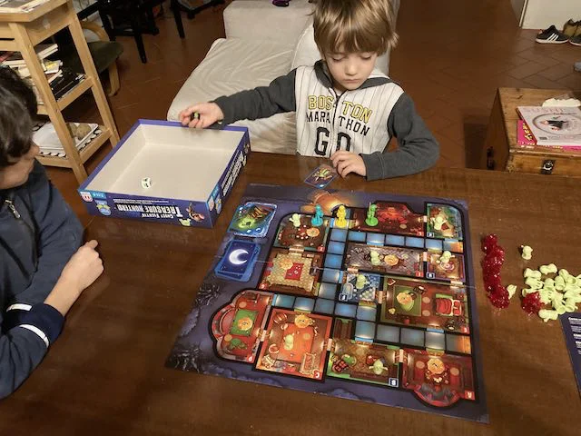

Un gioco collaborativo semplice e accessibile anche ai bambini: cacciare i fantasmi è un bel lavoro, e farlo insieme è divertente.

> [!info] Stefano
> L'avevo scelto perché vincitore del premio *Kinderspiel des Jahres*, ovvero miglior gioco per bambini, e confermiamo che sono sininimi di qualità. Nel dubbio, andate sul sicuro!

