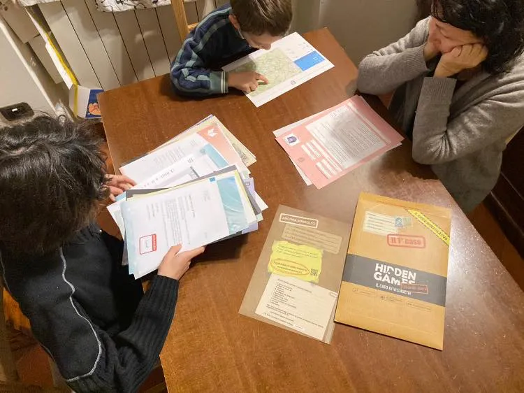

avete amato Glass Onion, Murders in the Building, la Signora in Giallo e tutto quanto?

il gioco Hidden Game è davvero il più bel investigativo sul mercato dei giochi per famiglia. si apre una busta e ci sono davvero dozzine di documenti da studiare, collegare, decifrare… e poi telefonare a numeri di telefono REALI o scoprire come entrare in siti internet per avere più indizi.

Davvero un capolavoro considerato che costa come due pizze.

Stra-consigliato per gli amanti del genere (è abbastanza difficile )
