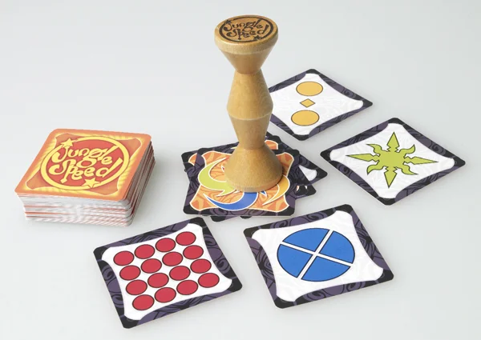

Osservazione e Riflessi: Jungle Speed li allena senza troppe spiegazioni e regolamenti. Il totem di legno è poi un bel oggetto che invogli ad esserepreso.
Ci sono diverse edizioni, tutte equivalenti cambia solo l'estetica.

> [!info] Stefano
> Un gioco che ha fatto la storia e mantiene il suo valore. 
