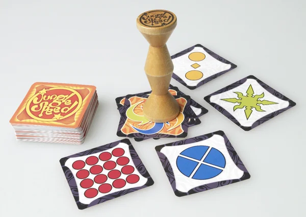

> **#Kids #Destrezza #Compatto**  
> 2-8g | 5+ | 10m | facile | [scheda](https://boardgamegeek.com/boardgame/8098/jungle-speed)   

Osservazione e Riflessi: Jungle Speed li allena senza troppe spiegazioni e regolamenti. Il totem di legno è poi un bel oggetto che invogli ad esserepreso.
Ci sono diverse edizioni, tutte equivalenti cambia solo l'estetica.

> *Stefano:*
> Un gioco che ha fatto la storia e mantiene il suo valore. 

