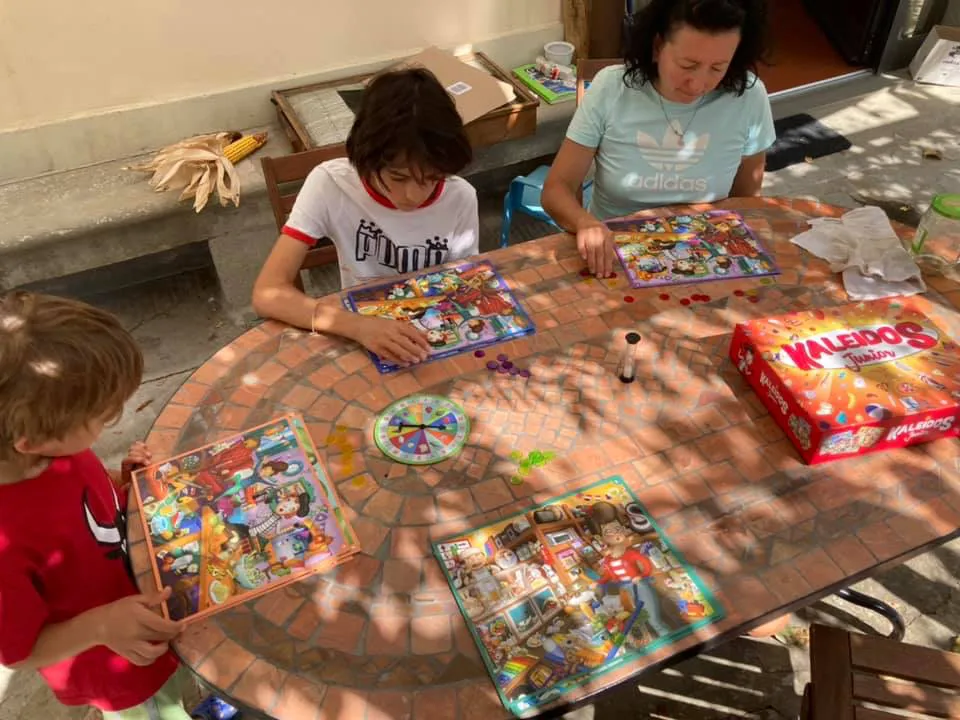

Il gioco che sta facendo impazzire figlio 2: Kaleidos Jr. 
abbiamo tutti lo stesso tabellone strapieno di oggetti e cose di tutti i tipi e un minuto per trovare quante più corrispondenze con la categoria o la lettera sorteggiata.
bravo Spartaco Albertarelli! unico appunto il manuale che non è chiarissimo, ho dovuto leggerlo tre volte nonostante la semplicità del gioco 🙂
voto: 8, perfetto per i 5/6 anni con handicap opzionali per i più grandi 
