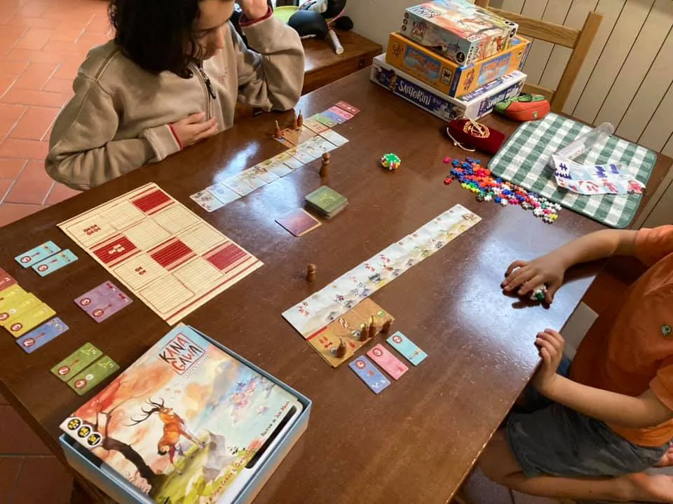

finalmente giochiamo a Kanagawa

un po’ di sconforto per le 6 pagine di istruzioni un po' nuvolose. ma fatti due round è tutto chiaro e veloce. e si sente che uno dei due autori è del team di 7 Wonders. di fatto figlio 1 è passato dallo scetticismo iniziale ad una crescente attenzione per tenere sotto controllo tutte le possibili somme di punti vittoria per poi ovviamente vincere.

questo perché i punti si possono fare in 5 modi diversi. e tenere a mente tutto è un bel lavoro mentale.
