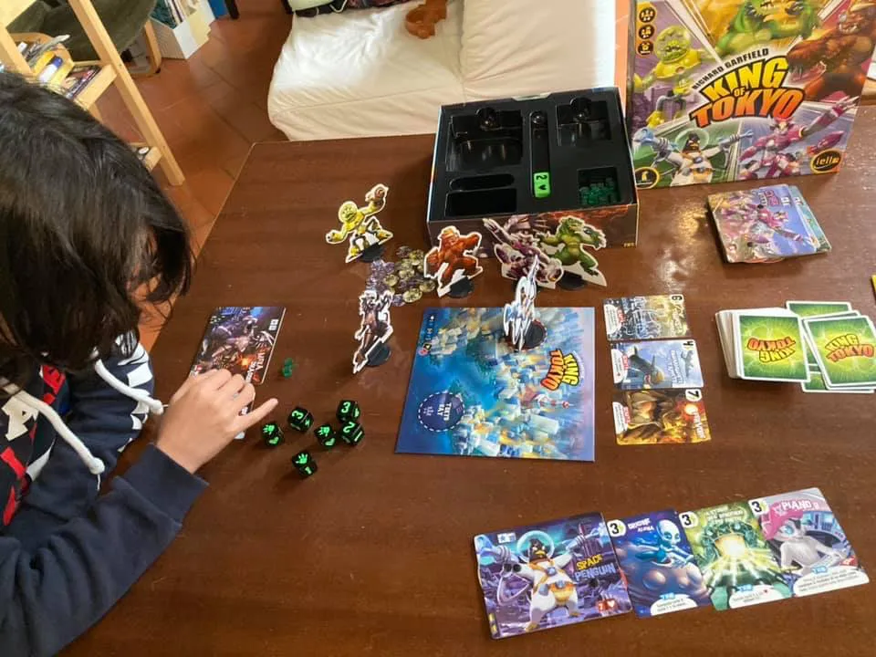
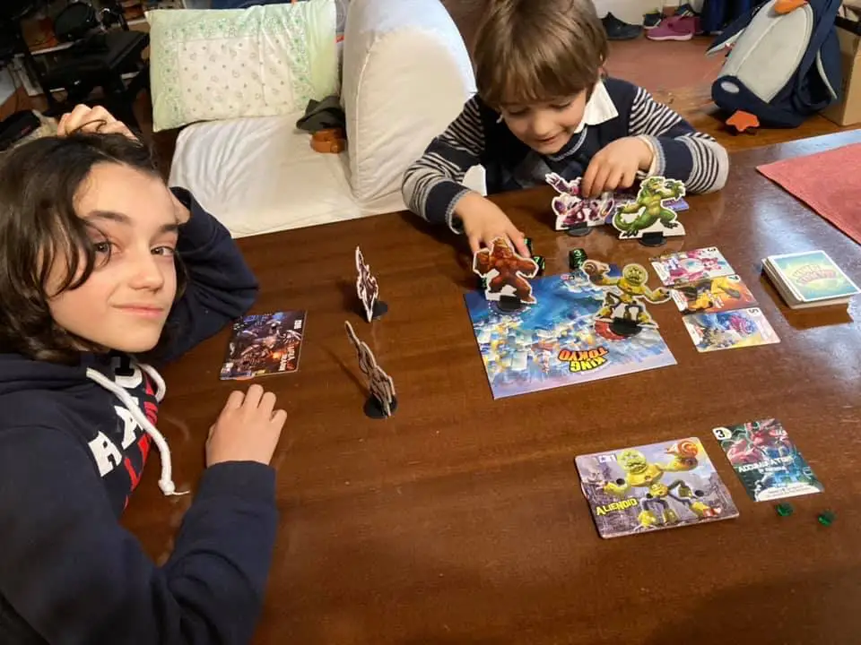

figlio a casa? niente dad? allora si fa lezione interdisciplinare: italiano, matematica, storia, geografia e ginnastica tutte insieme con un pizzico di analisi per valutare se il regolamento da 2 giocatori si può migliorare.

King of Tokyo è davvero divertente

partite velocissime (15 minuti se si è bravi) e adrenalinico. in 3/4 è probabilmente perfetto non vediamo l’ora di portarlo in ludoteca!

provato in 3 con il 5enne e funziona benissimo! facile da capire e divertentissimo a inventare i nomi di tutti gli attacchi speciali e facendo controllare due mostri a testa è davvero coinvolgente. domani disegneranno nuove mappe di gioco.

NB: c'è anche una versione New York e Dark Tokyo.. prendete quella che più vi piace!

> [!tip] Fabio davvero facile, bellissimi disegni e attacchi diversi da comprare prima degli altri dal mazzo delle carte speciali

> [!info] Stefano divertente anche per me giocare con i ragazzi. e quasi quasi ci possiamo creare nuovi personaggi. NB: l'autore di questo gioco è Richard Garfield (Magic).. una garanzia di qualità!

