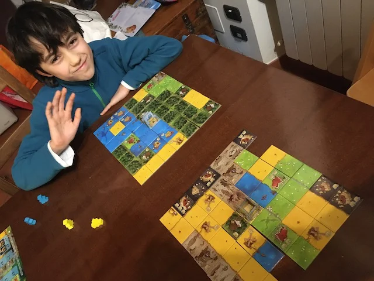

> **#Family #Party #Visuale #Award**   
> 2-4g | 7+ | 20m | facile | [scheda](https://boardgamegeek.com/boardgame/204583/kingdomino)  

un domino dove si costruisce il territorio intorno al proprio castello
veloce (10/15 minuti a partita) ma non banale.. ha una profondità notevole
bello bello

> *Fabio:*
> è bello pensare alla tattica da usare per scegliere il prossimo terreno e sopratutto alla fine vedere tutto il territorio che hai creato

