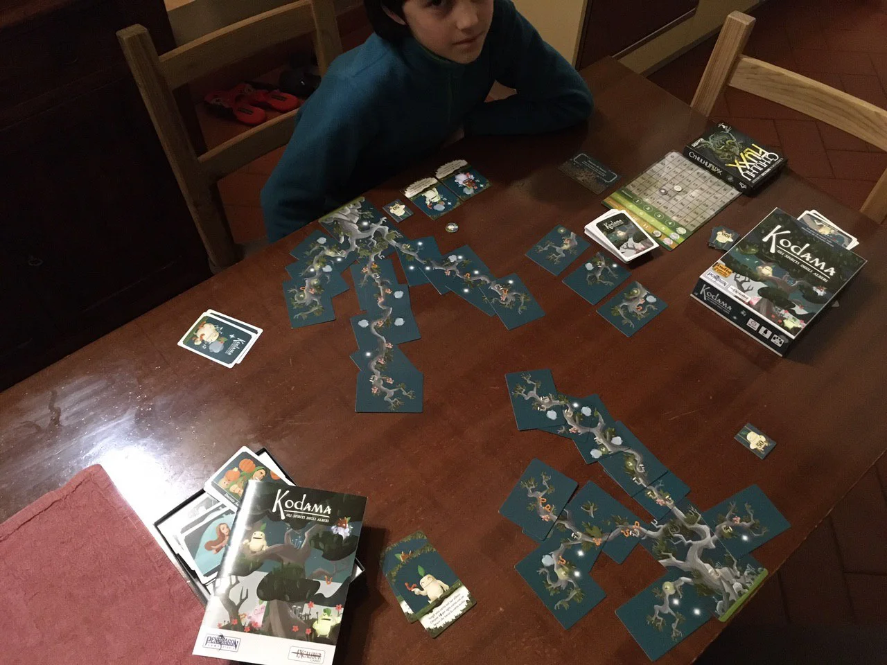

per veri amanti degli alberi e dell'armonia naturale.
siamo i folletti custodi degli alberi, e vogliamo farli crescere per bene... e verremo ricompensati con tante foglie punto quanto soddisferemo le moltissime e divertenti regole logico/matematiche che ogni stagione presenterà.

ci credo che è un gioco raccomandato dal [Mensa](../../notes/riferimenti/organizzazioni/mensa.md) ! 
ovviamente Fabio mi ha battuto per 2 punti all'ultimo tronco.. divertente. abbastanza veloce, cervellone ma non troppo, ricco di imprevisti.

approvato e consigliato! (si gioca da 2 a 6 giocatori.. direi dai 7 anni in su.. stimola molto il conteggio aritmetico)

> [!tip] Fabio
> omini e ambientazione simpaticissimi e bellissimi, sembrano usciti da un film di Myazaki
> c'è anche un regolamento semplificato per bambini
