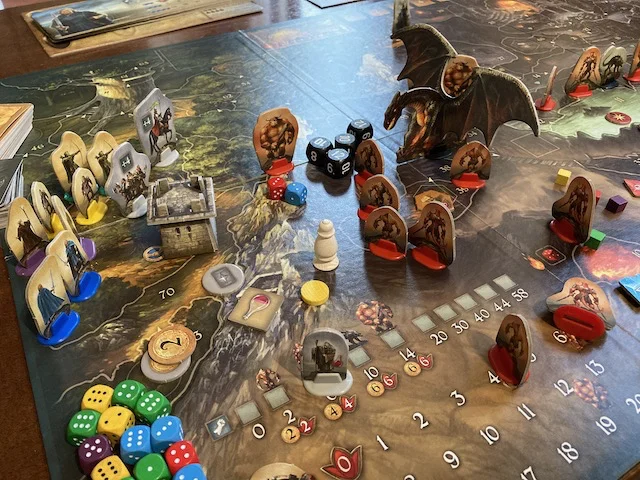

Un bellissimo Gioco di Ruolo semplificato che si gioca senza che che nessuno debba fare il Master, perché sostituito dalle carte. Si può iniziare a giocare velocemente senza troppa preparazione perché l'avventura introduttiva introduce le regole base e poi via via quelle più avanzate
Ci vuole un po' di tempo (almeno 2 ore e mezza a ascenario) ma è completo, avvincente, e sopratutto un collaborativo vero. Non dimenticando le miniature in cartone, che permettono di giocare avventure libere.

> [!tip] Fabio
> è divertente giocarci in 4 amici e sconfiggere i mostri tutti insieme e ha una mappa bellissima!

