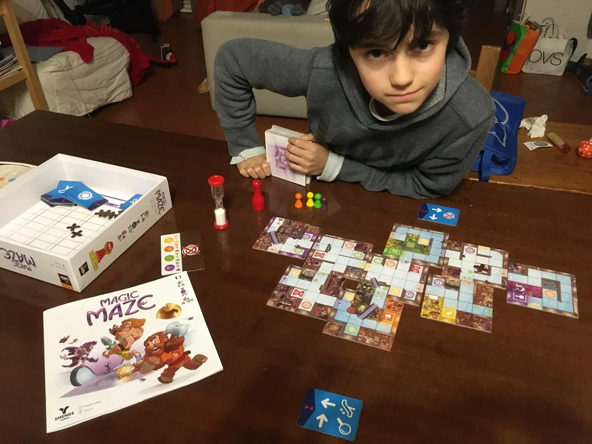

Qui si raggiungono vette di tensione contro il tempo e di muta collaborazione. Nel **senso che non si può parlare** ma si gioca tutti insieme muovendo tutti i pezzi in tempo reale ognuno con le proprie regole.
Non è un gioco per tutti (provarlo prima di comprarlo) ma ha questa originalità nelle meccaniche di gioco a squadra che potrebbe benissimo essere (e lo è infatti) usato per migliorare le capacità di muoversi insieme.
