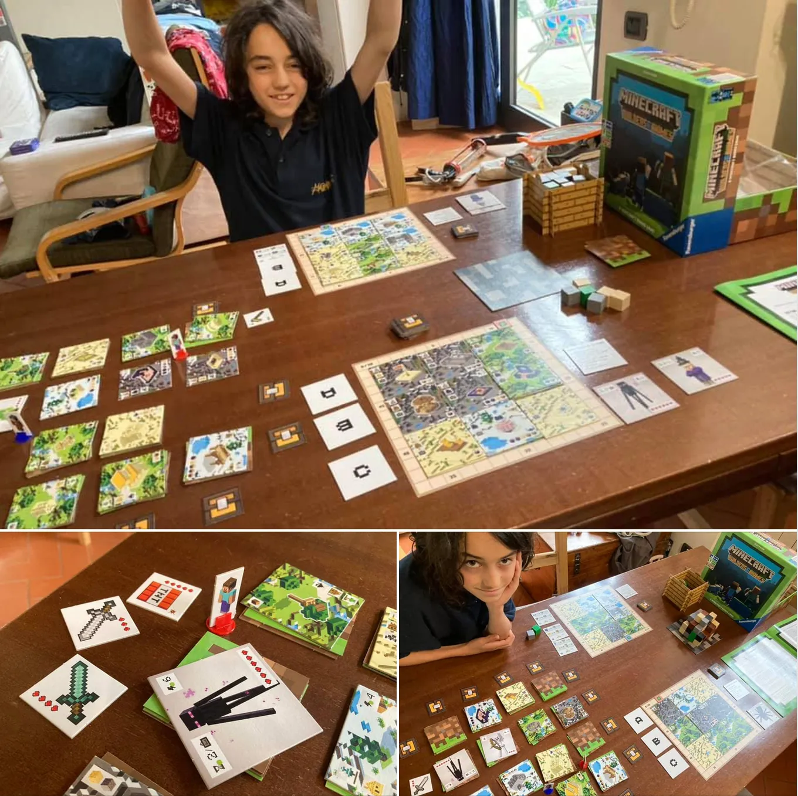

il regalo di fine scuola e il sospettai che fosse interessante perché ha fatto notte sotto le coperte a leggere le istruzioni (ricordo io in seconda media lo stesso con i manuali di D&D). il tema del gioco è sicuramente coinvolgente. 
ma fatta una partita di prova abbiamo scoperto che è da un lato semplice da capire e spiegare, dall’altro molto ampio come possibilità di scelte ed entusiasmante. 
puoi scavare, costruire, combattere gli endermen con la TNT e anticipare le mosse dell’avversario. 
eletto da entrambi nostri gioco preferito in assoluto tra tutti quelli che abbiamo.

partita in 4 e gira bene. si spiega facile e in 10 minuti si è già capito tutto. promosso.

> se in casa ci sono dei fan di Minecraft, è comunque un ottimo modo per coinvolgerli ad uscire dal digitale e sedersi intorno ad un tavolo

> [!tip] Fabio
> bello craftare nuovi oggetti e fare loot
