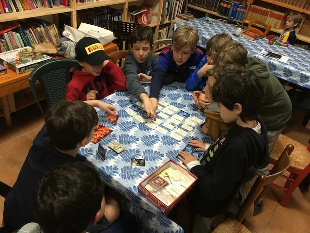

> **#Family #Party #Parole #TeamBuild #Award**    
> 4-10g | 8+ | 30m | facile | [scheda](https://boardgamegeek.com/boardgame/178900/codenames)  

gioco di parole a due squadre. divertente, concitante: devono indovinare i propri agenti segreti dal loro nome in codice, partendo da una parola "sinonimo o associata" proposta dal capo squadra. mi sorprende quanto piaccia!

