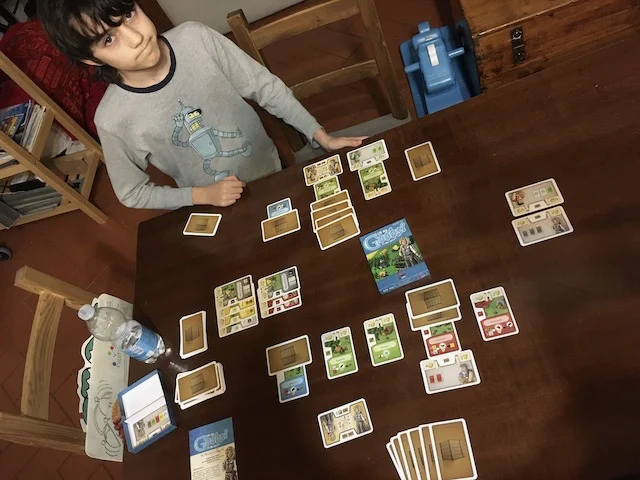

gestionale semplice ma davvero profondo
è un mazzo di 110 carte ma si costruisce di tutto con meccaniche non banali

un sabato sera a testare un nuovo gioco minimale: 110 carte con le quali sviluppare una propria azienda di produzione: dal carbone alla legna, al grano ai cibi, vestiti, scarpe e merci sempre più elaborate combinando le risorse, costruendo nuovi edifici e assumendo assistenti lavoratori che vanno al mercato all'alba a prendere le materie prime e alla sera a venderle.

incredibile come con solo delle carte abbiano creato un sistema così elaborato, ma facile da imparare e giocare. (ADDENDUM: non è facilissimo. a Fabio piace perché è difficile)

sarebbe perfetto, "se solo ci fosse un po' di commercio e trattativa tra i giocatori" (così commenta Fabio e .concordo)
potremo integrarla noi? intanto lo proveremo in 4 un prossimo venerdì.

NB: questi giochi necessitano di memoria, attenzione, tattica, visione d'insieme, immaginazione.. sicuramente male non fa. ed è una scatolina da mettere in borsa

> [!tip] Fabio
> bello produrre e vendere merci e ci sono infinite possibilità di commercio
