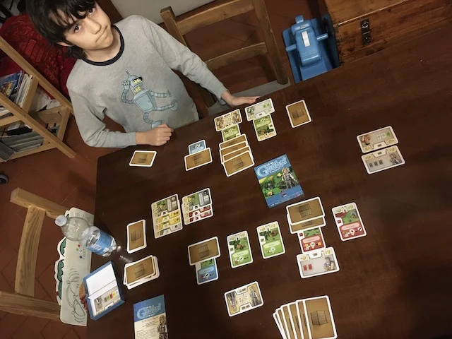

gestionale semplice ma davvero profondo
è un mazzo di 110 carte ma si costruisce di tutto con meccaniche non banali

> *Fabio:*
> bello produrre e vendere merci e ci sono infinite possibilità di commercio
