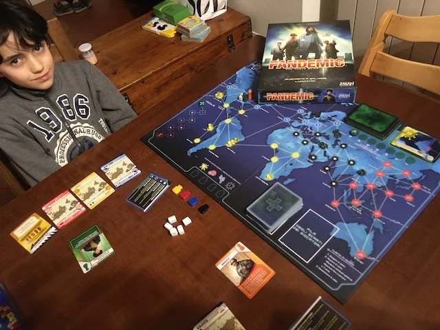

debellare una pandemia di 4 virus prima che sia troppo tardi 
collaborativo, bello (dal creatore di Deserto Proibito), famoso.
merita.

> *Fabio:*
> bello viaggiare in tutto il mondo per fermare il virus
