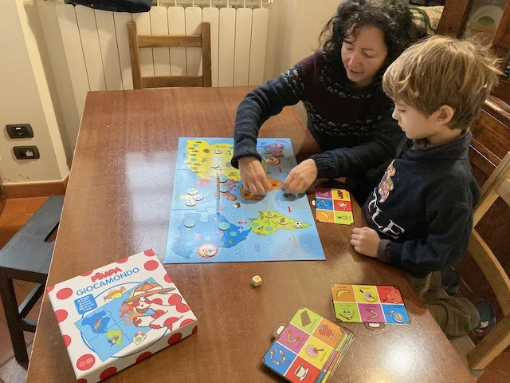
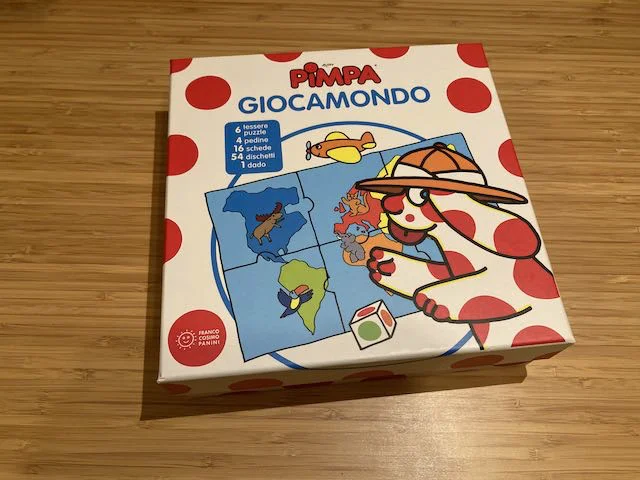

Gioco molto semplice, con due livelli di difficoltà, dove si inizia a prendere dimestichezza con la mappa del mondo, perché bisogna andare in giro a cercare degli oggetti tipici, molto simpatico e poi almeno un gioco della Pimpa dobbiamo averlo!

> *Fabio:*
> Ogni tanto ci gioco con Bruno perché la Pimpa ci piace
{.boxFabio}

