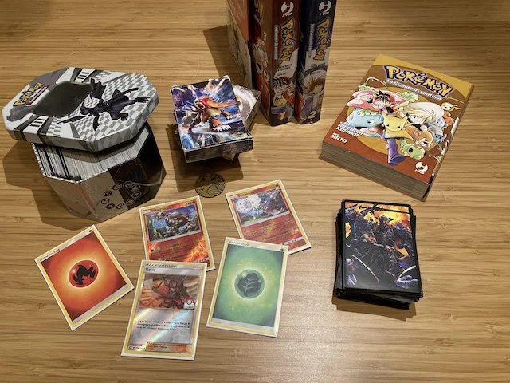

organizzando tornei fino in 20

il famosissimo gioco di carte che lo giocano quasi tutti i ragazzi ogni settimana.
l'ho studiato un po' e non è male neanche per gli adulti ogni tanto fare una partita. un mazzo base costa circa 15 euro e garantisce di poter affrontare chiunque e divertirsi.

> [!tip] Fabio
> bello ottimizzare il proprio mazzo di carte, ci sono tantissimi Pokemon ognuno con sue abilità e mosse, e poi ci giocano tutti quindi è buono per farsi nuovi amici
