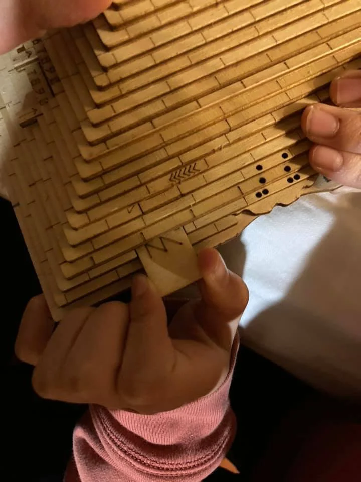
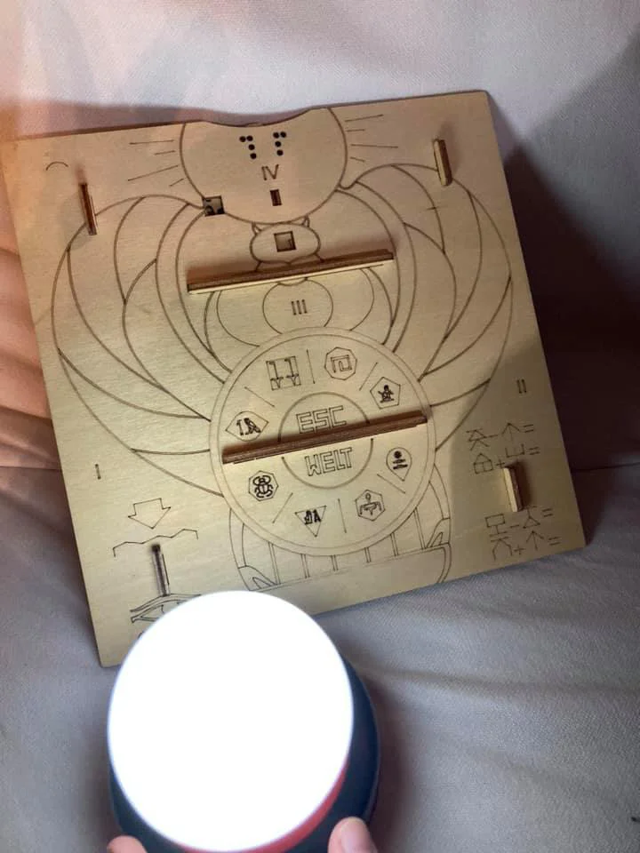
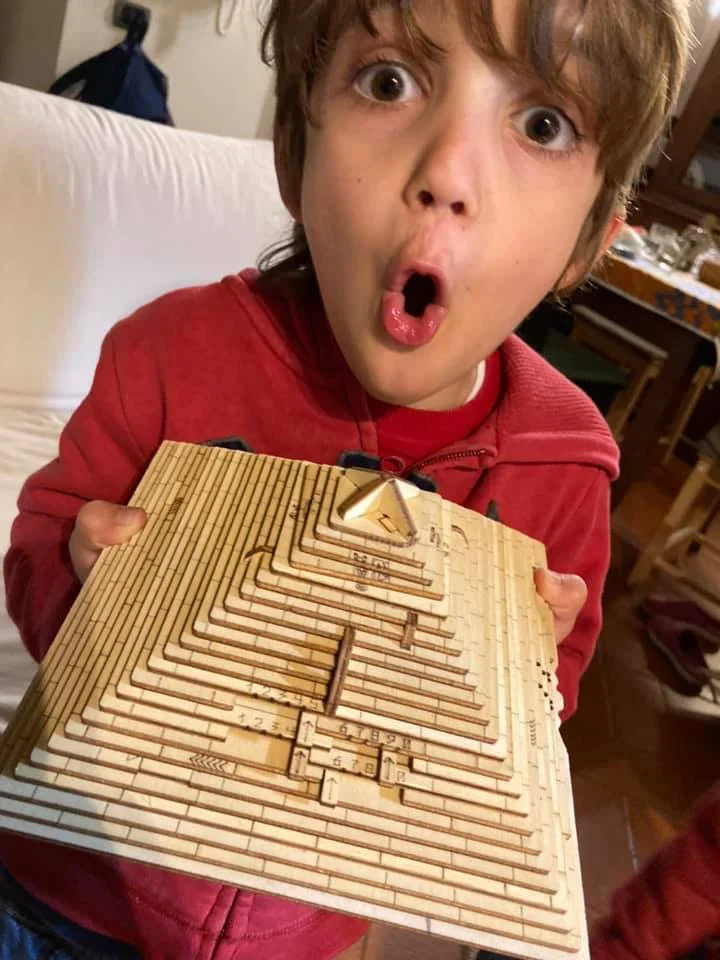
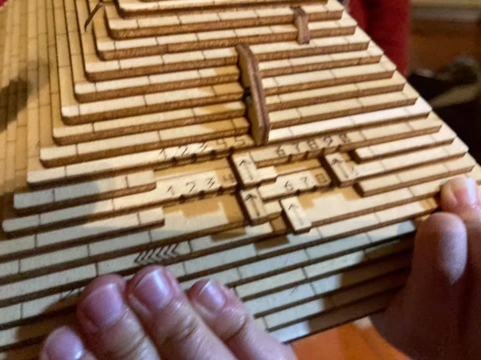

quest’oggetto è davvero unico nel suo genere: una piramide in legno piena di enigmi e meccanismi meccanici da risolvere per svelare il mistero degli antichi Egizi
dopo tante escape room digitali o ambientali, ecco mettere alla prova lo spirito di osservazione e la logica deduttiva con qualcosa di manuale.
tanto immersiva che dopo un po’ il piccolo Bruno ha avuto quasi paura di un rumore proveniente dall’interno!
vi faremo sapere come va 🙂
NB: il bello di questi giochi è che una volta svelati o risolti, si ricompongono e si possono regalare ad altri

EDIT dal mattino dopo:
FINITA! ovviamente il grande si è svegliato alle 7:03 per entrare nella piramide proprio a quell’ora (no spoiler). ho rifatto gli enigmi fini a lì e poi finita insieme. bella! la durata complessiva è si di un’ora poco più. non è lunghissima ma enigmi interessanti e soprattutto è bellissimo dal punto di vista meccanico e ingegneristico cercare di capire come l’hanno fatta e come funziona. Sa bravi tombaroli abbiamo lasciato il nostro messaggio nella cripta così da avviare una catena con il prossimo a cui la passeremo. 
alcuni enigmi si possono cercare di risolverli con il piccolo ma non è in grado da solo. direi 10/11 anni per essere autonomi. vale questa esperienza 32 euro? per i nostri gusti e per la riproducibilità/regalabilità, si. è poi un bellissimo oggetto di arredo per ricordarci che bisogna saper guardare da altri punti di vista per risolvere meccaniche e misteri altrimenti incomprensibili. voto: 9. 

DOVE ACQUISTARLA: cercare Escape Welt / Quest Pyramide io l'ho trovata solo sul loro sito, a mio avviso si può acquistarne una per quartiere e poi la si condivide 🙂

> [!tip] Fabio bellissima. avrei solo voluto più enigmi magari più facili. in ogni caso davvero un ottimo lavoro

> [!info] Stefano risolverla insieme, in due è meglio, magari la sera, con la pila, e immedesimarsi nei tunnel dentro la piramide!
