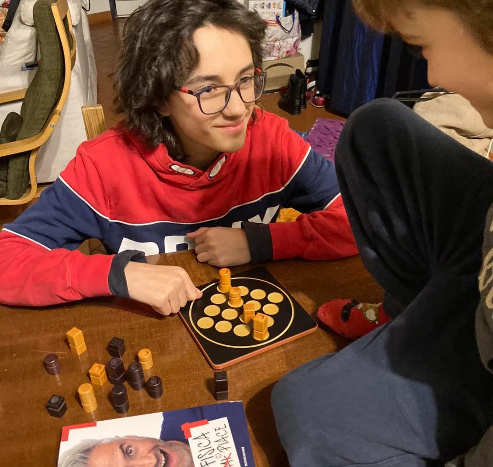

16 pezzi, ognuno con una combinazione di quattro virtù:

- altezza (alto o basso)
- colore (bianco o nero)
- forma (cilindro o parallelepipedo)
- cappello (con o senza buco)

il primo che mette in fila 4 pezzi con una stessa caratteristica, vince.

MA il plot-twist è che il pezzo da giocare non lo scegli tu, ma il tuo avversario!

> Fabio: è il mio gioco preferito perché è piccolo, veloce, non casuale, stimolante

