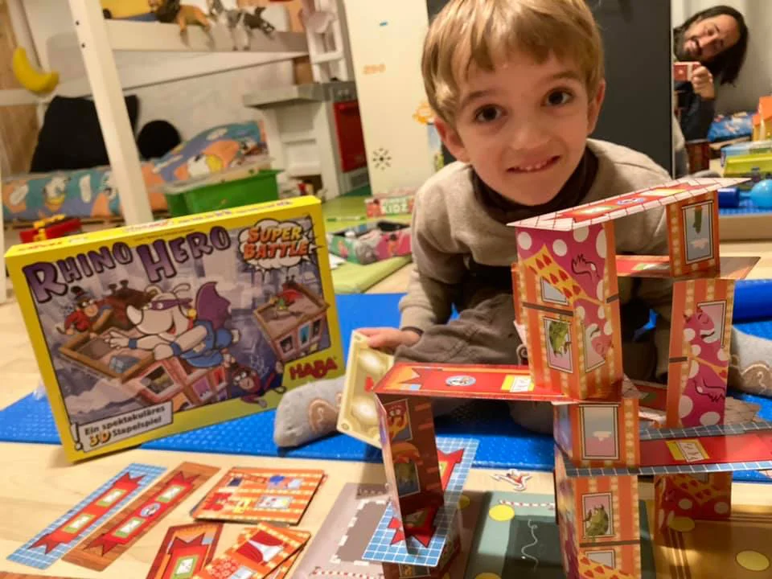

Ci mancava un gioco di equilibrio, di spazialità e di calcolo matematico, e Rhino Hero coinvolge tutti questi temi in modo divertente, facendo costruire "castelli di carte" e facendoci salire i propri personaggi a combattere con i dadi, stando attenti alle scimmiette in equilibrio

Ricordiamoci che ci sono molte aree dell’intelligenza e a seconda dell’interesse si può trovare il gioco giusto per svilupparle!

> [!tip] Fabio
> Allena molto a non tremare e mettere le cose in equilibrio

> [!info] Stefano
> La costruzione di castelli di carta funziona anhce senza gioco, e la HABA produce sempre solo bellissimi giochi per bambini.

