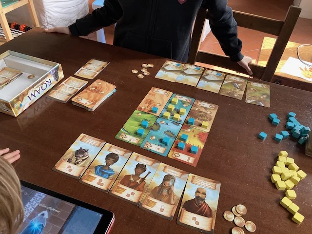

trovare i patterns sulla griglia di gioco per conquistare più territorio prima degli avversari.
grafica bellissima, meccaniche semplici con due livelli di difficoltà

> [!tip] Fabio
> mi piace che ogni personaggio abbia una sua propria mossa, ovvero territorio conquistabile
