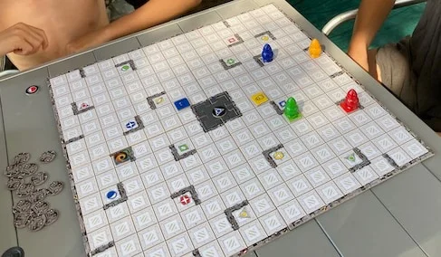

si può giocare da 1 a.. 90!
non ci sono limiti di giocatori né di età per questo gioco unico.
di fatto si gioca tutti nella propria mente

> [!tip] Fabio
> mi piace il cercare con la mente di trovare il percorso migliore nel minor tempo possibile.
