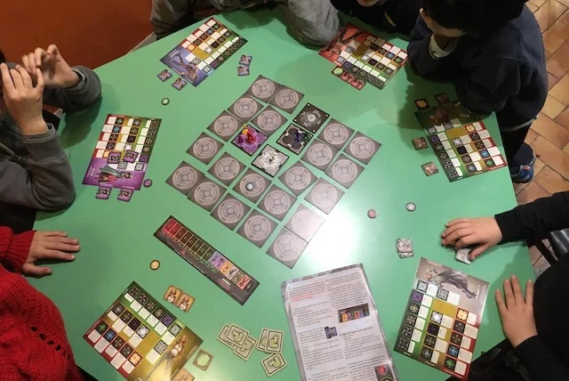

siamo prigionieri nel futuro e dobbiamo scappare.. mappa della prigione dinamica.. possiamo modificarla.. piena di trappole! riusciremo?
bella ambientazione.. abbastanza facile.. con modalità di gioco collaborativa o competitiva, con o senza sabotatori.. bello!

> [!tip] Fabio
> mi piacciono le tante stanze con gli effetti diversi e non sai mai cosa ti capita
