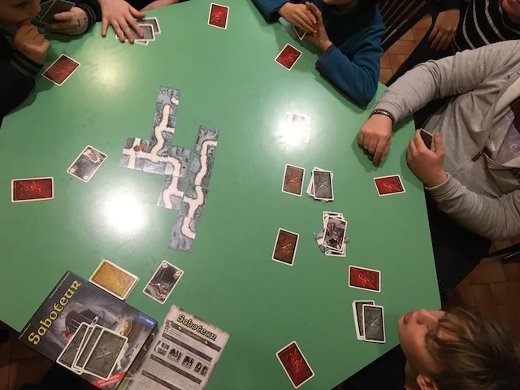

 

In Saboteur siamo tutti nani, ma alcuni sono "sabotatori" segreti che devono impedire agli altri di trovare le gemme scavando dei tunnel sotterranei.. davvero coinvolgente perché è tutto un gioco di squadra e controsquadra, cercando di capire chi va e dove.. e alla fine vince una delle due squadre.. ma su più turni puoi cambiare squadra!
divertente! 
**ottimo quando siamo in tantissimi.**

## Tutorial

<iframe width="560" height="315" src="https://www.youtube-nocookie.com/embed/jgyuzgSylsg?si=hX-_4OglVJf5GqD9" title="YouTube video player" frameborder="0" allow="accelerometer; autoplay; clipboard-write; encrypted-media; gyroscope; picture-in-picture; web-share" allowfullscreen></iframe>
[📺 YouTube](https://www.youtube.com/watch?v=jgyuzgSylsg)
