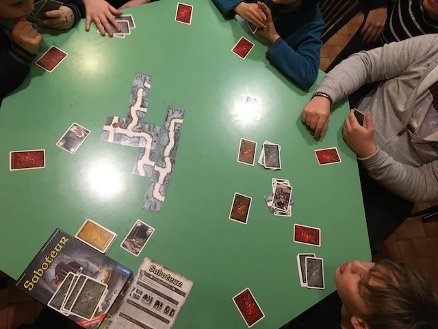

---
title: Saboteur
slug: 
description: ""
categories: [boardgame]
tags: [Family, Party ,Impostore]
date: 2020-12-14
lastmod: 

template: played.html
played_category: boardgame
played_skills: []
played_gameplay_complex: 1
played_gameplay_strategy: 
played_gameplay_luck: 
played_gameplay_interaction: 

played_preferred: 
played_rank_edu: 
played_rank_dev: 
played_rank_kid: 

played_players: 6-10
played_age: 7
played_duration: 30

played_publisher: 
played_year: 
played_url_details: https://www.boardgamegeek.com/boardgame/143147/saboteur-compilation-editions
played_url_play: 
--- 

In Saboteur siamo tutti nani, ma alcuni sono "sabotatori" segreti che devono impedire agli altri di trovare le gemme scavando dei tunnel sotterranei.. davvero coinvolgente perché è tutto un gioco di squadra e controsquadra, cercando di capire chi va e dove.. e alla fine vince una delle due squadre.. ma su più turni puoi cambiare squadra!
divertente! ottimo quando siamo in tantissimi.

> *Fabio:*
> è divertente sia essere un nano e cercare l'oro sia fare l'impostore. e l'essere in miniera ci piace sempre a noi ragazzi
