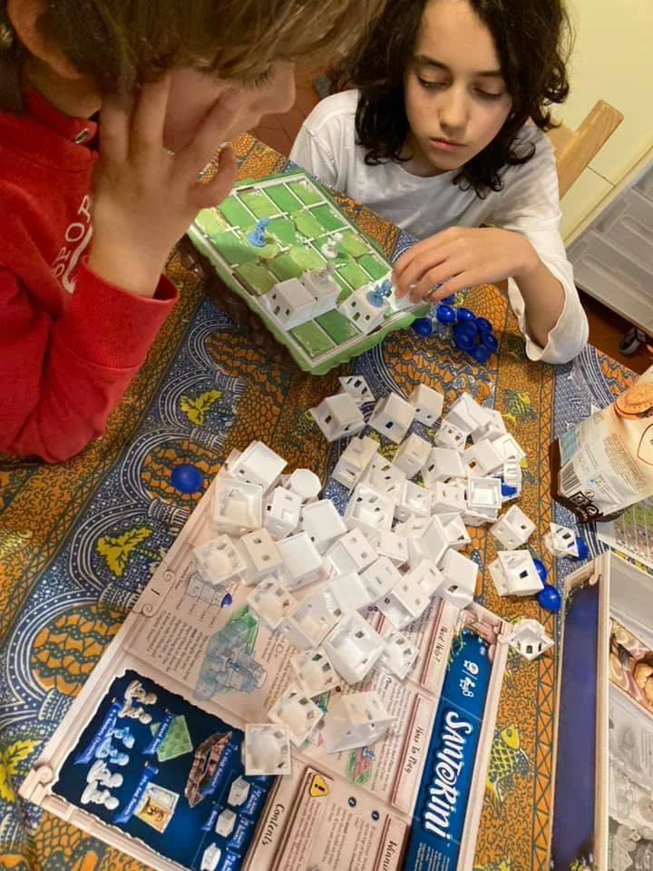
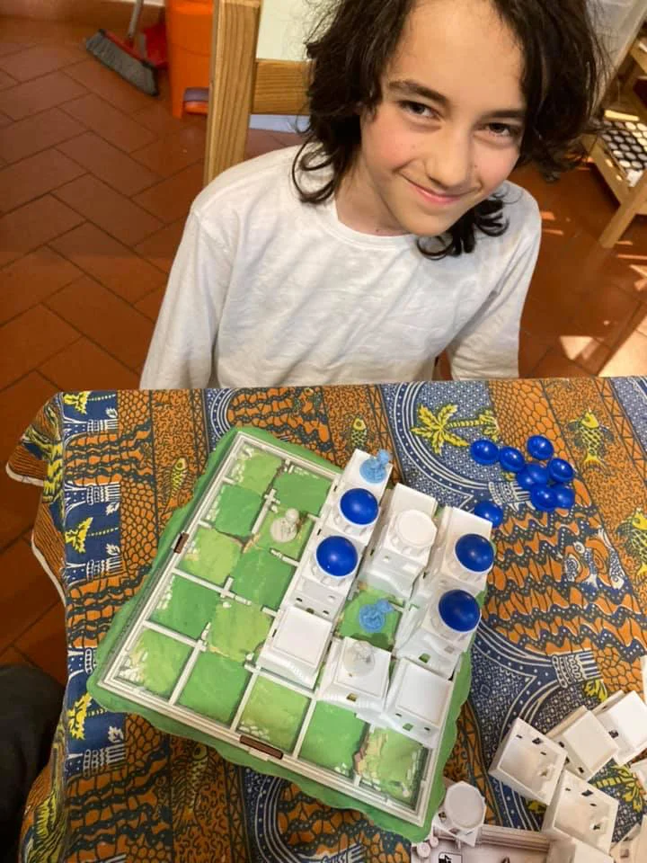
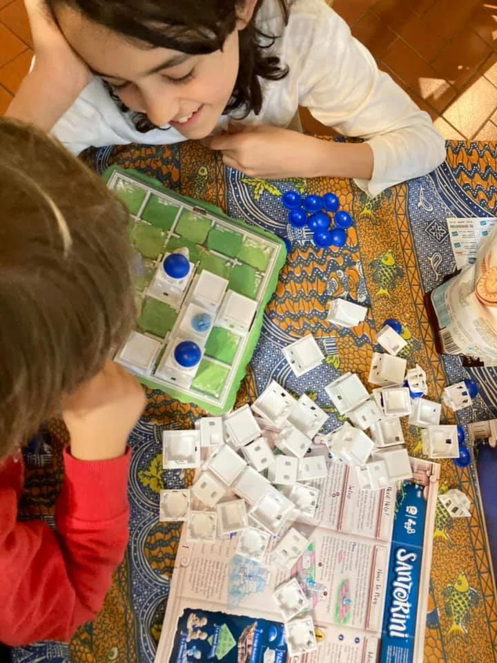

per festeggiare ottimi voti, abbiamo inaugurato quello che è entrato subito nella Top5 dei giochi preferiti: Santorini
così semplice che anche il cinquenne ci gioca dopo 30 secondi di spiegazioni (si tratta di muovere di una casella e alzare torri e vince il primo che sale al terzo livello), ma con una strategia che si inserisce mossa dopo mossa, tra la dama e gli scacchi.
mi ha davvero sorpreso come in pochi minuti fossimo già a un livello di tattica e complessità maneggevole ma non banale.
e non abbiamo usato le carte “dei” delle regole avanzate che danno super poteri ovvero mosse speciali.
ottimo in due giocatori ma anche in 3 o 4.
ovviamente ha vinto Fabio. ma con le partite che durano 10 minuti una tira l’altra.

> [!tip] Fabio bello perchè veloce ma ti fa pensare

> [!info] Stefano gioco perfetto
