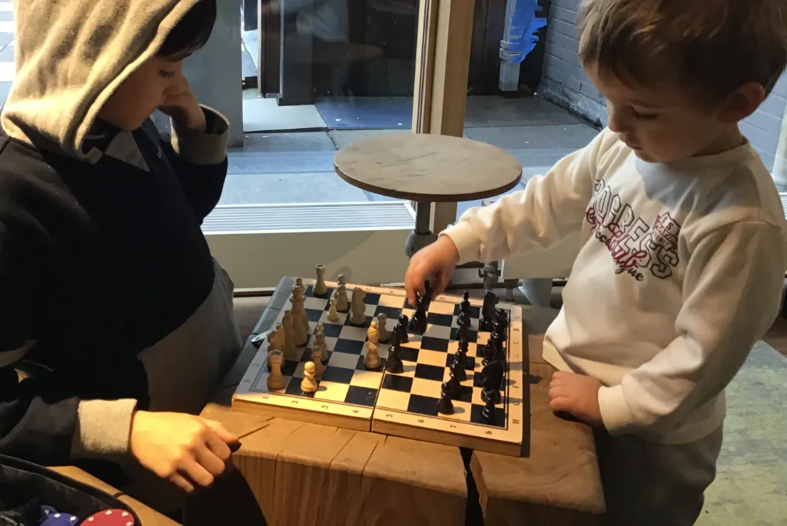
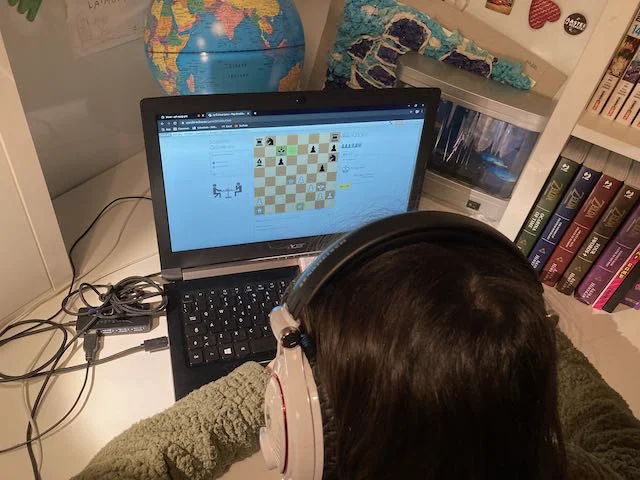

Non dovrebbe necessitare presentazioni se non accennare a delle buone motivazioni per intavolarlo, ogni tanto, senza la pretesa di diventare una regina degli scacchi

1. è giocato da TUTTI nel mondo.
2. non c'è caso né mistero, è un gioco a "informazione perfetta" dove entrambi i giocatori sanno e vedono tutto
3. le regole sono così semplici, ma non banali, che è bello studiarle
4. ti obbliga a pensare la mossa possibile, e immaginare / prevedere, almeno le prossime 2 mosse (avversario e mia risposta), quindi intuire cosa sia una strategia
5. ai ragazzi piace
6. esistono centinaia di versioni.. anche in digitale dove i pezzi combattono sanguinosamente! :) (cercate BattleChess)

