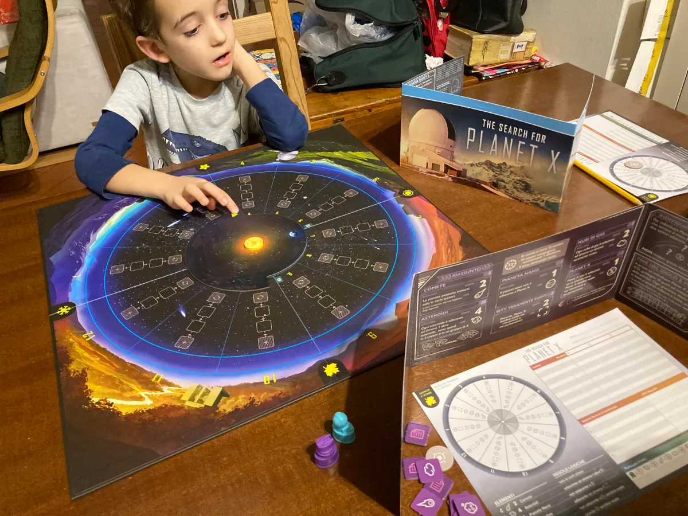

cercavamo IL gioco di deduzione logica che fosse veloce, sempre nuovo, con diversi livelli di difficoltà magari pee ogni singolo giocatore, che fosse a tema scienza… beh questo gioco è la risposta.

immaginatelo come un ”super Sudoku” a tema astronomia, dove gli indizi e le regole sono scovate facendo ricerche e interrogando la app (che genera una diversa configurazione per ogni partita) e osservando come giocano gli avversari.

davvero geniale e ci credo che ce lo hanno regalato per studiarlo come ottimo esempio di esperienza di ricerca logica competitiva.

lo abbiamo anche usato per ripassare mesi e stagioni 😉
