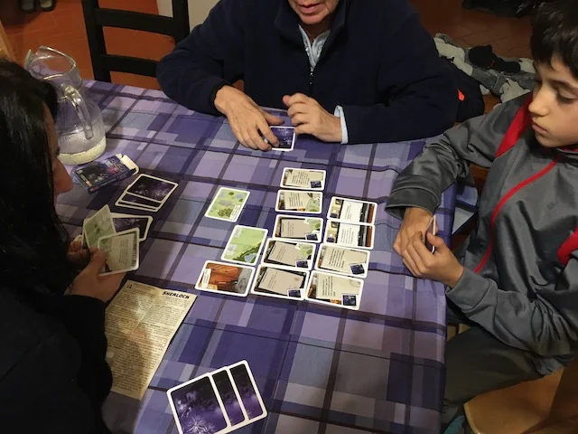

il gioco più piccolo esistente (quasi un pacchetto di fiammiferi) con dentro giusto le 40 carte necessarie ad intavolare un caso misterioso da risolvere con collaborazione e tanto dialogo!

ci sono molti episodi noi ne abbiamo provati un paio.. un must se vi piacciono i gialli!

> *Fabio:*
> molto difficile ma anche molto sorprendente quando confronti la tua soluzione
